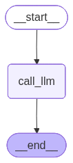
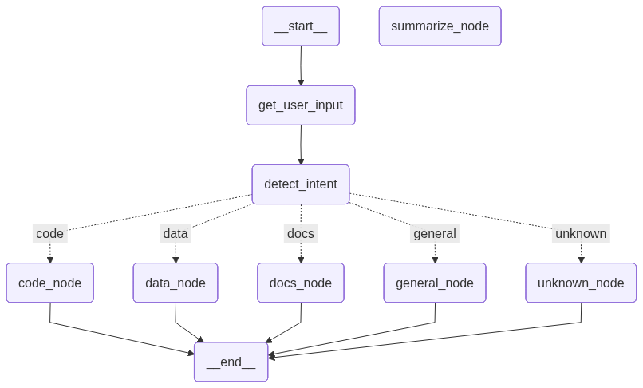
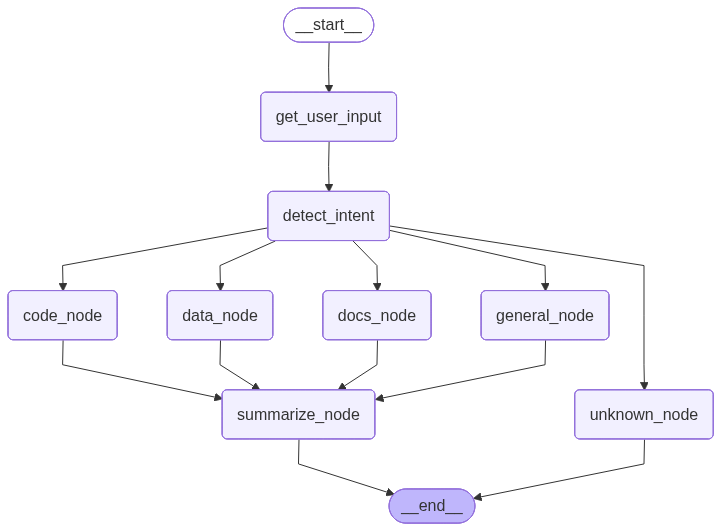

# Simple LangGraph App
This repository contains simple examples demonstrating how to build and use graphs with LangGraph.

Each version adds a small layer of complexity so you can clearly understand how data and control flow through a graph-based AI system.

## 📦 Versions Overview
### 🔹 Version 1 — Basic LLM Call

This is the simplest version.

Takes a user query as input.

Sends the query directly to the LLM.

Returns the LLM response as output.

Flow:

`User Input → LLM → Response`

### 🔹 Version 2 — Intent-Based Routing

This version introduces intent detection and conditional routing.

Takes a user query as input.

Detects the intent of the query.

Routes the query to the most suitable node based on the detected intent.

Returns the response from that node.

This demonstrates how LangGraph can be used to create dynamic execution paths.

Flow:

`User Input → Intent Detection → Conditional Node → Response`

### 🔹 Version 3 — With Optional Summarization Node

This version shows a graph that also contains a summarize node.

The summarize node is currently not connected in the default flow.

It can be connected after any node or at the end of the graph to summarize the output.

This allows easy post-processing or response refinement.

Flow (optional):

`Any Node → Summarize → Final Output`

## 🧠 Why This Repo?

This repo is meant to:

Help beginners understand LangGraph concepts step-by-step.

Show how to go from a simple linear chain to a conditional graph.

Demonstrate how to extend the graph with new nodes (like summarization) without changing existing logic.

## 🚀 Next Steps

You can try:

Adding more intent types and specialized nodes.

Plugging in tools (APIs, databases, search, etc.).

Connecting the summarize node to different parts of the graph.

Visualizing or logging graph execution paths.